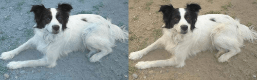

# Install
`pip install git+https://github.com/Jako-K/justshowit`

# How to use
```python
from justshowit import show 
show(<your_image_source>)
```

# Demo


```python
from justshowit import show 
import cv2
import numpy as np
import torch
import random

# Example of different input images
url = "https://github.com/Jako-K/justshowit/blob/test_images/test_image1.png"
numpy_image = np.random.rand(250, 400, 1)
torch_image = torch.ones((3, 300, 200)) * 255
image_bgr = cv2.imread("./test_images/test_image2.jpg")
path1 = "./test_images/test_image2.jpg"
path2 = "./test_images/test_image3.png"
path3 = "./test_images/test_image4.png"
```


```python
# You can show a single image
image = show(path1)
```


```python
# Do some basic, but very common stuff
show(image_bgr, resize_factor=0.50, BGR2RGB=True, save_to_path="./super_nice_image.png")
```


```python
# Show a bunch of similiar sized images 
show([image_bgr, path1], resize_factor=0.5)
```




```python
# This will automatically decide an appropriate column and row layout + resize
show([image_bgr for i in range(27)], BGR2RGB=True)
```


```python
# Finally, you can also show a bunch of differently shaped images together
show([url, torch_image, numpy_image, path1, path2, path3], resize_factor=0.5)
```


```python
# This will use a packing algorithm which will try and find an effecient layout
random_images = [random.choice([url, torch_image, numpy_image, path1, path2, path3]) 
                 for _ in range(100)]
show(random_images)
```


# Choice of layout

I have used the bin packing library [rectpack ](https://github.com/secnot/rectpack) to solve layout problems in situations where one or more images differ in size. This doesnt always present the images in a good way (weird looking holes, grouping of similar looking images, etc.), but I was unable to find a better solution myself. I was, however, able to find a better solution in cases where all images have the same width and height. The primary goal of this solution was to display all received images in a visually pleasing way. Defining "visually pleasing" in a way that could be formalized was a surprisingly difficult thing to do, and I wanted to try and explain my reasoning/implementation for anyone interested. The figure below should hopefully do just that:


